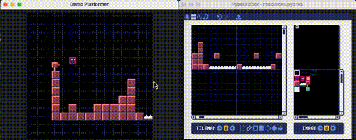
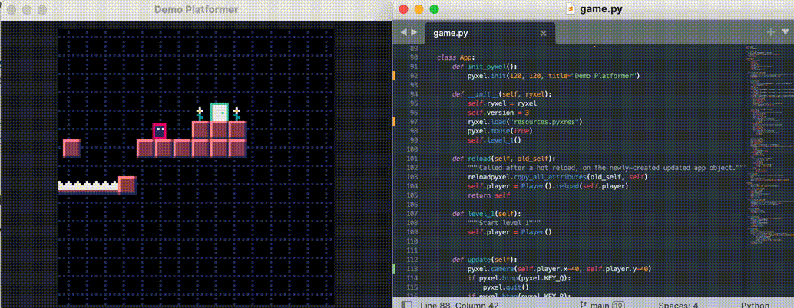

# Reload-Pyxel

*Reload-Pyxel* is a library for the [retro game engine Pyxel](https://github.com/kitao/pyxel) that adds the ability to hot-reload both code and assets.

That means that now, while the game is running, if you change your graphics or edit the code, the changes will be reflected live in your game - without restarting it!

This includes your source files (`.py`), resource files (`.pyxres`) and all their contents (images, tilemaps, music), external images (`.png/.gif/.jpg`), and external tilemaps (`.tmx`). A mechanism is included so you can write code to hot-reload any other file type as well.



The gif below shows an example where you walk to a part of the level, realize the collison detection isn't working right, fix it, and you can see the result of your change immediately.



Without Reload-Pyxel, you would have to quit your game, restart it, and navigate back to the level you updated to see the effect of your changes. This can be automated to a point with `pyxel watch`, but it still puts you back at the beginning.

## How to use

The use is very similar to normal Pyxel, with a few tweaks.

### Create Reload-Pyxel application

1. Copy both the `reloadpyxel.py` and `main.py` files onto your project folder.

2. Create your own game and call it `game.py`. Here are the starting contents:

```python
import pyxel
import reloadpyxel

class App:

    @staticmethod
    def init_pyxel():
        pyxel.init(160, 120, title="My Pyxel Game!")

    def __init__(self, repyxel):
        # Load your resources here
        repyxel.run(self)

    def update(self):
        if pyxel.btnp(pyxel.KEY_Q):
            pyxel.quit()
        # Code to update your game state goes here

    def draw(self):
        pyxel.cls(0)
        pyxel.rect(10, 10, 20, 20, 11)
        # Code to draw your game goes here

    def reload(self, old_self):
        """Called when code is reloaded"""
        reloadpyxel.copy_all_attributes(old_self, self)
```

You can use all the Pyxel functions as before, refer to [the Pyxel README](https://github.com/kitao/pyxel) for instruction on how to make a Pyxel game.

You also start the program as before, with

```bash
pyxel run main.py
```

The differences are:

1. Your App class must be in `game.py` (you may add other files as needed)
2. You must copy the reloadpyxel's `main.py` and `reloadpyxel.py` files next to your `game.py`
3. `pyxel.init` is moved to a required function called `init_pyxel`
4. `pyxel.load` is replaced with `repyxel.load`
5. `pyxel.run` is replaced with `repyxel.run`, which takes your class as argument
6. (optional) To enable code hot reload, include the `reload` method as shown above.
   In that function you must make whatever adjustments are needed to copy the state
   of your game from the old code to the new code and re-instantiate all your objects
   using the new code.

When you are done developing you app you can replace `repyxel.run` with `pyxel.run`
to remove the hot reloading and get back the small bit of performance it consumes.

## Examples

The repository includes multiple examples in the `examples/` folder, split into those that only hot-reload resources and those that also hot-reload the code.

These include examples from the original pyxel that were adapted to include the hot-reload capability. As you can see in the code, not much needed to be modified.

A simple example that is a good starting point is [`examples/code_and_resources/pyxel_originals/01_hello_pyxel/`](examples/code_and_resources/pyxel_originals/01_hello_pyxel/)

## API

### main.py

The main file you need to include will do four things:
1. Create a reloadpyxel object
2. Call your `init_pyxel` function
3. Create your `App`, passing it the reloadpyxel object
4. Start the game

### reloadpyxel

- `copy_all_attributes(source,destination)`
  Copies all the attributes from the source object to the destination object.
  for example if `source.x=2` before the call, then `destination.x=2` after the call.

- `load(name_of_resource_file, [excl_images], [excl_tilemaps], [excl_sounds], [excl_musics])`
  Load the resource file (.pyxres). If an option is `True`, that resource will not be loaded.
  Afterwards, watches that file and will reload it if if changes.
  When that happens, your App's `reload_resource` method will be called (if it exists).

- `run(app)`
  Runs the Pyxel game. Your app must have the `update(self)` and `draw(self)` methods that Pyxel needs. 
  It will reload resources and code if they are modified.
  You typically do not need to call this yourself, it's called in `main.py` for you.

- `watch_resource(filename)`
  Watches that file. If it changes, will call your App's `reload_resource` method (if it exists).

- `images[i].load(name_of_image_file, [excl_images], [excl_tilemaps], [excl_sounds], [excl_musics])`
  Load the specified image (png/gif/jpg) into the image bank number `i`. 
  Afterwards, watches that file and will reload it if if changes.
  When that happens, your App's `reload_resource` method will be called (if it exists).

- `tilemap[i].load(x, y, tmx_filename, layer)`
  Load the specified tilemap (tmx format) into the tilemap bank number `i` at the specified layer.
  Afterwards, watches that file and will reload it if if changes.
  When that happens, your App's `reload_resource` method will be called (if it exists).

### Your App

Your game must be in `game.py` in a class named `App` with the following methods:

- `update(self)`
- `draw(self)`

In addition, you can have the following optional methods:

- `reload(self, old_self)`
  ReloadPyxel will call this method whenever any code was reloaded.
  In that case, it will have created a new instance of your `App` object
  and calls that method on it, passing to it the old instance.
  It is your responsibility to transfer the state to the new object,
  for example via the helper function
  `reloadpyxel.copy_all_attributes(source,destination)`.
  If you're holding on to other objects (perhaps a `Player` or `Enemy` you wrote),
  then you will want to replace those with a new instance.

- `reload_resources(self, list_of_file_names)`
  ReloadPyxel will call this method whenever any resource was reloaded. It includes the
  list of resources that were reloaded.
  Normally you don't need to do anything special when a resource is reloaded,
  but this can be useful if you asked for a custom file to be watched (say, a `.json`)
  and want to reload it yourself.

