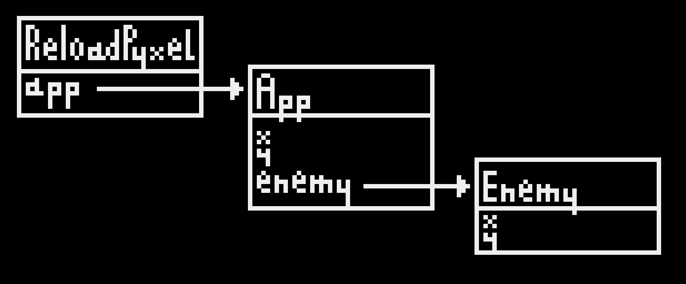

# Hot-reloading code in reloadpyxel

## Scope

The reloadpyxel library allows you to hot-reload code in your game. This includes:

- Your `game.py` file
- Any other Python file you're including from there
- Python libraries you're using

It excludes the `main.py` file, but it's simple and shouldn't need to change.

## How to use it

Here is an example snippet from a Pyxel program.

```python
def update(self):
    # Move player
    if pyxel.KEY_RIGHT: 
        self.x += 1
        self.dir = 1
    if pyxel.KEY_LEFT:
        self.x -= 1
        self.dir = -1

def draw(self):
    pyxel.cls(0)
    # Draw player
    pyxel.blt(self.x,self.y, 0,0,8, self.dir*8,8, colkey=0)

```

To add hot-reloading to this program, you need to add the `reload` method. Here is an example:

```python
def reload(self, old_self):
    """Called after a hot reload, on the newly-created updated app object."""
    reloadpyxel.copy_all_attributes(old_self, self)
```

That's all that's needed. Now if you add, say, the ability to go up and down, that code will be loaded into your live program and your character will be right where you left them.

That's because the `copy_all_attributes` function will copy the `x` and `y` variables from the previously-running code onto the newly-reloaded code, preserving your state.

If you are holding on to objects, say a `Player` or `Enemy` class, then you will need to update those as well. Let's see how to do this, by way of how hot-reloading works.

## How code hot-reloading works

Let's suppose your app has some variables of its own, `x` and `y` to track the position of the player. It also has an `Enemy` class with code to move the enemy, and member variables `x` and `y` to track the position of the enemy. ReloadPyxel has a reference to your app, as shown in the figure below.



Here each rectangle represents an object. At the top is the class name, and underneath are the member variables, one per line. Those that are references are shown with an arrow to the thing they are referencing. So here for example your app's `draw` method you might look like this:

```python
def draw(self):
    pyxel.cls(0)
    # Draw player
    pyxel.blt(self.x,self.y, 0,0,8, self.dir*8,8, colkey=0)
    # Draw enemy
    pyxel.blt(self.enemy.x, self.enemy.x, 0, 8,8, 8,8)
```

ReloadPyxel gets the list of modules in use by the program, and the source file for each. Then it reads the last-modified-time for each of these files, and checks it again periodically.

When it detects that any of those files has changed, it uses Python's [`importlib.reload`](https://docs.python.org/3/library/importlib.html#importlib.reload) capability to reload the corresponding class. Python will give it the same name as the old class, so now when ReloadPyxel calls `App(repyxel)` it constructs a new object, using the new code. But the old objects still exist in memory, and they're still using the old code.

ReloadPyxl updates its reference to the new object, so that its `update` and `draw` methods are called every frame. Then it calls the new object's `reload` method, passing the old app as argument: this is for state transfer, meaning that your code in `reload` is responsible for copying the `x` and `y` values from the old object - this way, the player stays at the same spot when the code is reloaded. There is a helper function for that, it's `reloadpyxel.copy_all_attributes` (this code is already in the template).

At this point we have a new app with the correct coordinates for the player, but it still has a reference to the old `enemy` object, using the old code.

So what you have to do in your `reload` method is create a new instance of the `Enemy` object - since you're creating it after the new code has been loaded, this instance will be using the new code. Then you need to transfer state from the old enemy to the new one. You could for example add a `reload` method to your `Enemy` class, and have it call `reloadpyxel.copy_all_attributes`.

The final situation then is that both the App and Enemy are using the new code, and the state is otherwise unchanged: the player and the enemy are still where they were before the reload.

Here is the code:

```python
class App:
    def reload(self, old_self):
        """Called after a hot reload, on the newly-created updated app object."""
        # copy x,y
        reloadpyxel.copy_all_attributes(old_self, self)
        # Update enemy code, copy enemy.x, enemy.y
        self.enemy = Enemy().reload(self.enemy)

class Enemy:
    def reload(self, old_self):
        """Called after a hot reload, on the newly-created updated enemy object."""
        reloadpyxel.copy_all_attributes(old_self, self)
        return self
```


----

Up: [Hot-reload, explained](hotreload-explained.md)
